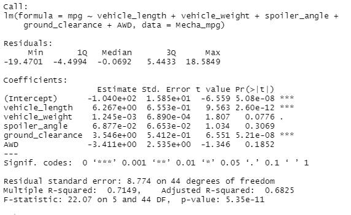
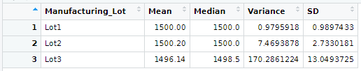
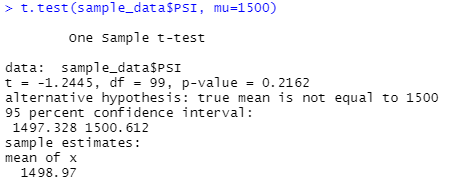
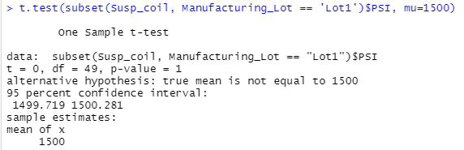
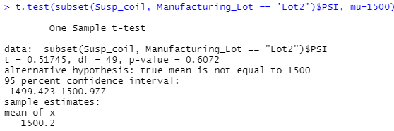
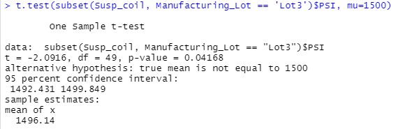

# MechaCar_Statistical_Analysis

## Background

MechaCar has an issue to prevent the production progress.  We will use our R analytic knowledge to find out the problem.

### Linear Regression to Predict MPG

The linear regression of MPG related to vehicle_length, vehicle_weight, spoiler_angle, ground_clearance and AWD is shown in the following image:

We will answer the following questions:

- Which variables/coefficients provided a non-random amount of variance to the mpg values in the dataset?

​		From the results, we can see that **vehicle_length** and **ground_clearance** are the non-random of variance to the mpg values.

- Is the slope of the linear model considered to be zero? Why or why not?

  The slope of the linear model is not considered to be zero.  It is because the t-test shows the p-value is significant to reject the  assumption that the slope of the linear model is zero in the cases of vehicle_length and ground_clearance.

- Does this linear model predict mpg of MechaCar prototypes effectively? Why or why not?

​		Yes.  It is because the t-test p-value is far beyond the significant level (0.05)

### Summary Statistics on Suspension Coils

The total_summary and the lot_summary of the suspension coils PSI values:

​																					**total_summary**

​																						**lot_summary**

- The design specifications for the MechaCar suspension coils dictate that the variance of the suspension coils must not exceed 100 pounds per square inch. Does the current manufacturing data meet this design specification for all manufacturing lots in total and each lot individually? Why or why not?

​		For all manufacturing lots in total, the design specification for the MechaCar suspension coils are meet because the variance is 62.3 PSI which is less than the specification 100 PSI.

​		For each lot individually, the design specification for the MechaCar suspension coils are **not** meet because the variance of Lot 3 is 170.3 PSI which is larger than the specification 100 PSI.

### T-Tests on Suspension Coils

#### t-test for all lots in total:

The t-test shows us that the suspension coils meet the required 1500 PSI with mean of 1498.97 and p-value = 0.22 (significant level = 0.05)

#### Individual 3 lots:

The t-test shows us that the suspension coils in **Lot 1** and **Lot2** meet the required 1500 PSI with mean of 1500,  p-value = 1 and mean of 1500.2, p-value =0.61, respectively.  (significant level = 0.05)

It also shows us that the suspension coils manufactured in the **Lot 3 do not**  meet the required 1500 PSI with mean of 1496.14,  p-value = 0.042. (significant level = 0.05)

### Study Design: MechaCar vs Competition

In the US car market, the consumers pay attention to many factors, such as cost, fuel efficiency, maintenance, horse power and safety rating.  We will choose cost as the statistical quantity  to differentiate MechaCar among the competitors.

We will answer the following questions:

- What metric or metrics are you going to test?

​		We will test the sales volume vs. the sales price in the same consumer income category;  We will use a linear model to describe the relationship of these 2 variables.

- What is the null hypothesis or alternative hypothesis?

​		The Null Hypothesis:  there is not linear relationship between the sales volume vs the sales price in the same consumer income category.

- What statistical test would you use to test the hypothesis? And why?

​		We will use t-test to test the hypothesis.  Because t-test could detect the linear regression significance to reject or accept the Null Hypothesis.

- What data is needed to run the statistical test?

​		We need to collect following data:

​				a. consumers income data in category of 0 - 50k, 50k - 100k, 100k - 150k, >150k;

​				b. the sales prices of the cars of MechaCar and its competitiors for the consumers;

​				c . the sales volume of the cars of MechaCar and its competitiors for the consumers.
